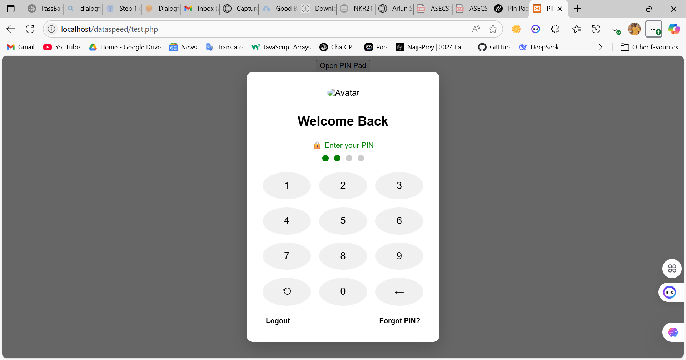

# PIN Pad Modal

A sleek and secure PIN pad modal built using vanilla HTML, CSS, and JavaScript — no frameworks required.

## Features

- Modal design with dark overlay
- PIN input with animated dots
- Responsive keypad layout
- PIN validation simulation

## Preview

## How to Use

1. Download or clone the repository
2. Open `index.html` in any browser
3. Click "Open PIN Pad" to try it out!

## Contributing

Feel free to fork and improve. PRs are welcome!

## License

MIT
